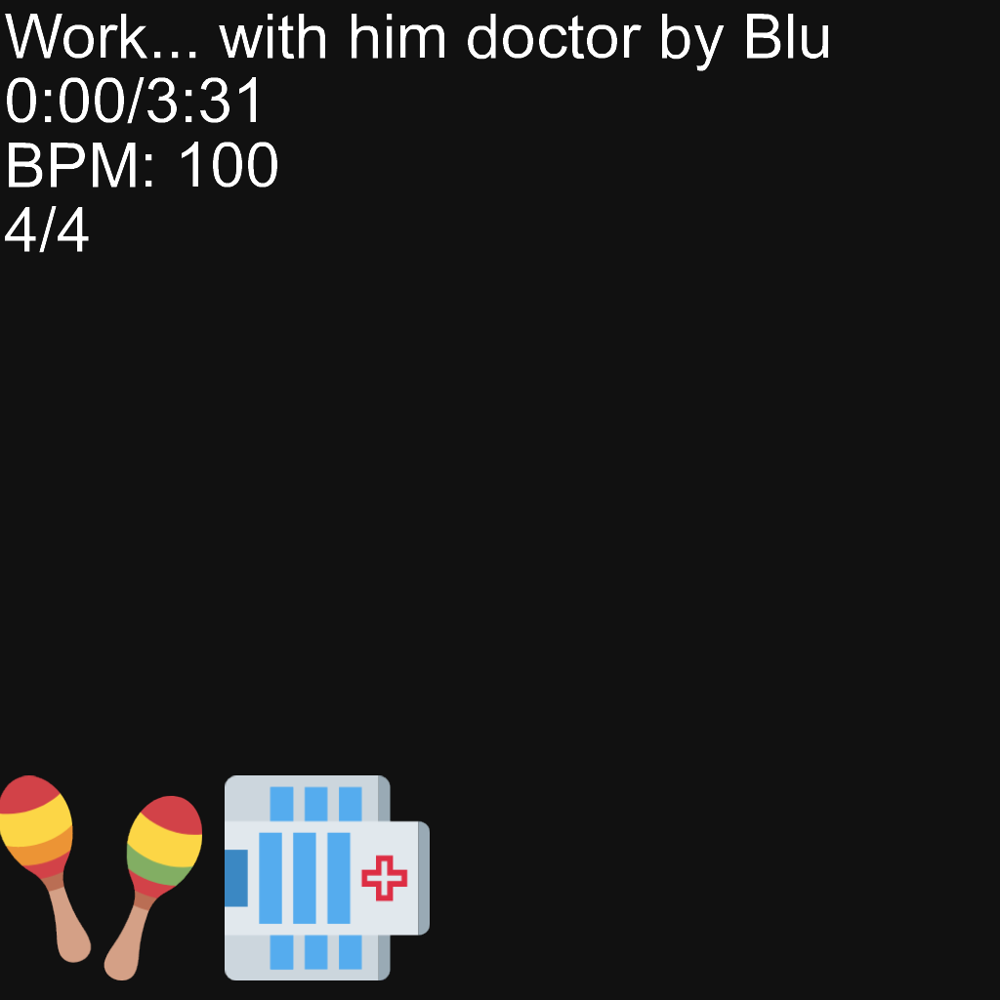

# Visualizemoji

<!-- > *"graphman is holding me hostage"* -->

> *"what the fuck is this and why is it in my recommended"*

Visualizemoji is a MIDI visualizer (Can be used without a MIDI.) that works by mapping each MIDI track to an emoji. That's it, that's the whole thing.

## Table of contents
- [Visualizemoji](#visualizemoji)
  - [Table of contents](#table-of-contents)
  - [Usage](#usage)
  - [Track naming scheme](#track-naming-scheme)
  - [Rundown on the file structure](#rundown-on-the-file-structure)
  - [Example](#example)
  - [FAQ](#faq)
  - [The "\*"'s](#the-s)

## Usage

> *"How do I use this?"*

The main files are:

- `videoSettings.json`
- the files that `videoSettings.json` accesses
- `code/emoji/emojiData.json` for the emojis
- `scripting.js` for custom effects and stuff

Use `node .` to run it.

## Track naming scheme

> *"How do I make/edit the MIDI for this program?"*

To make the emojis act in certain ways, you must name the tracks accordingly.

All of these flags apply on note press.

The track name is `X (+ "-Y" Z amount of times)`.

X is the ID of the emoji in the `emojiData.json` array.

Y can be:

`R` - Rotate clockwise 
`RA` - Rotate anti-clockwise 
`RR` - Rotate randomly (repeats can happen) 
`RRNR` - Rotate randomly, no repeats 

`P` - Pulse on note press 
`M` - Move in a random direction and slowly return back (North, East, South, West) 
`I` - The emoji doesn't fade out, instead it will just instantly disappear. 
`V` - The emoji's starting alpha will depend on the note's velocity. 
`S` - The emoji lasts twice as long. 

Rotational ones do not stack with each other.

Z can be as much as you want (Well... uh... within reason I suppose?).

Example track name: `2-RRNR-P-M-S`.

Emoji 2 will:

- rotate randomly, with no repeats
- pulse on note press
- move randomly in a direction
- and last twice as long

## Rundown on the file structure

> *"im being forced to ask: how does this work?"*

All the code is in.. well the `code` folder. 

`index.js` - Simply runs a few things, isn't really important persay. 
`frameRendering.js` - Handles the text and the base image. 
`prototypes.js` - Stores all the prototypes used for a "typescript" experience. 
`scripting.js` - Where you should probably write your code to do changes to the images.  

The `code/emoji` folder is where all the code for the emojis are.  

`emojiData.json` - Handles the id system and what emoji it links to. 
`emojiPrep.js` - Prepares the emoji images. 
`midiParser.js` - Understands the MIDI and sets up a note array. 
`emojiScripting.js` - Where all the image processing for the emoji frame is done.  

The `code/utils` folder is where.. well... utils are. 

`utils.js` - General purpose functions. 
`shaderUtils.js` - Functions for when you're "making a "shader"". (shader is just a js function, look in `scripting.js` for an example)

## Example

> *"how work >?/ ? ?  !1/1/???// 😁"*

Click on the preview image 😁😁 (takes you to youtube video)

## FAQ

> *"Why is this not using TypeScript while persay replicating features of it?"*

I find it easier to work with JS and plus just more convenient in my opinion to avoid compiling.

> *"What's the speed of this?"*

Not very good, I think. If you look in the `test` folder and view `2.mp4`, you can see a test video.
That video takes my pc (very high-end i think) ~1.5 hours to render in the VSC console.

> *"Has anyone actually asked these questions?"*

No. But we will add some actual asked question if people ask them a lot.

## The "*"'s

> *"Quote my unquote"*

\*  - Can be used without a MIDI.

\*\* - Well... uh... within reason I suppose?# Visualizemoji

